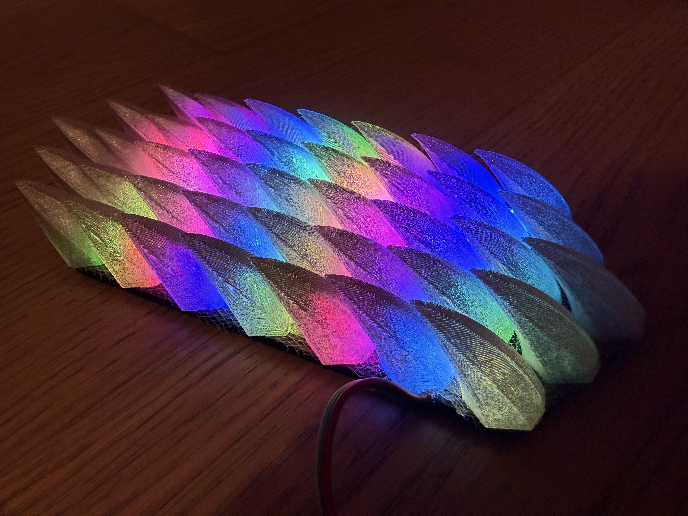
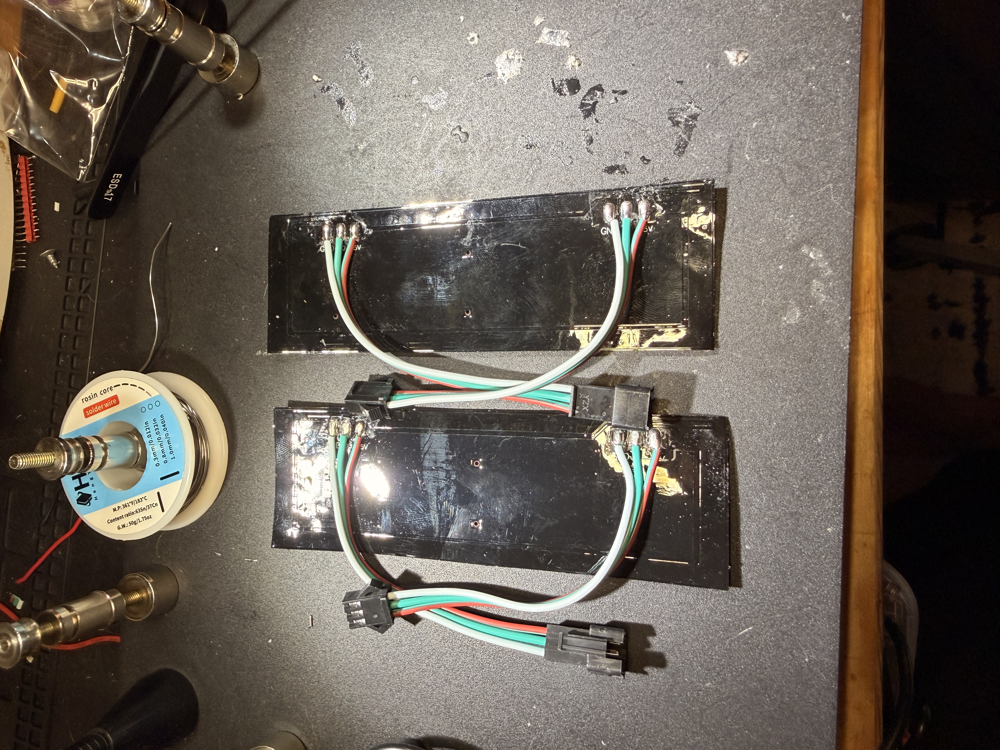
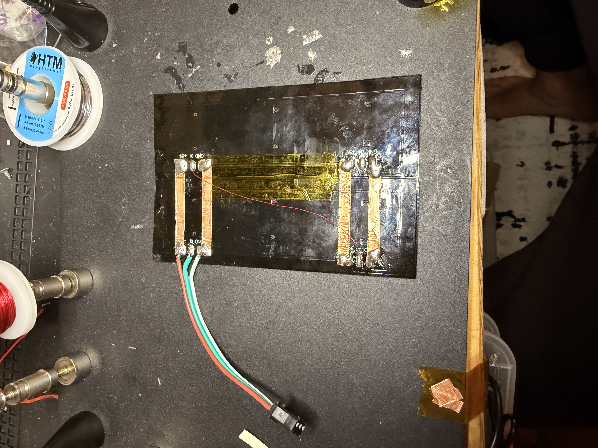
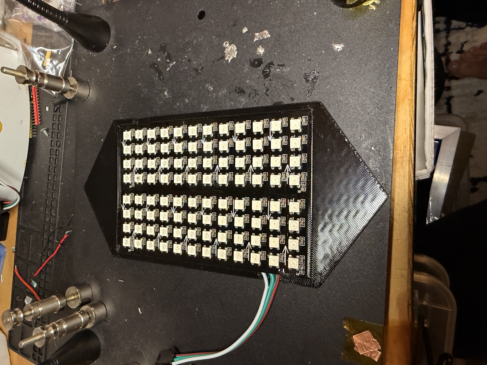

# Addressable LED Dragon Scale Patches

**Difficulty:** Intermediate  


Individually-addressable RGB LED shoulder patches, built around David Shorey's
(**ShoreyDesigns**) [Dragon Scales](https://www.thingiverse.com/thing:2755451)
print-on-fabric technique. Each patch is a sheet of scales printed directly
onto mesh, shingled over a printed tray that holds a chain of WS2812B-style
("NeoPixel") LEDs, so every scale (or column of scales) can be lit its own color.


## Table of Contents

- [How it works](#how-it-works)
- [Repo contents](#repo-contents)
- [Bill of materials (per patch)](#bill-of-materials-per-patch)
- [Step 1 — Print the base](#step-1-print-the-base)
- [Step 2 — Print the scales onto mesh](#step-2-print-the-scales-onto-mesh)
- [Step 3 — Wire the LED matrix](#step-3-wire-the-led-matrix)
- [Step 4 — Assemble the patch](#step-4-assemble-the-patch)
- [Step 5 — Mount and wire up](#step-5-mount-and-wire-up)
- [Credits](#credits)

## How it works

- **`Dragon_Scales_Patch-Base.stl`** — a flat ~88 x 185 x 3mm tray with a
  raised lip. Two small addressable-LED matrix boards sit inside it,
  recessed enough that the scale sheet can lie flush on top.
- **`Dragon_Scales_Patch-Scales.stl`** — a ~94 x 203 x 20mm sheet of
  overlapping scale shells. It is *not* glued on after printing — it's
  printed straight onto a piece of mesh/tulle fabric using Shorey's
  pause-and-embed technique (see below), so the whole scale sheet comes off
  the printer as one flexible, fabric-backed piece.
- Light from the LED matrix underneath diffuses through the translucent
  scales, and because the LEDs are individually addressable you get the
  color-gradient/rainbow-chevron look shown above rather than a single flat glow.


*Lit patch*

## Repo contents

```
stls/
  Dragon_Scales_Patch-Base.stl     # electronics tray, print per patch
  Dragon_Scales_Patch-Scales.stl   # scale sheet, print onto mesh, one per patch
pics/                              # build reference photos (see below)
```

## Bill of materials (per patch)

- 1x `Dragon_Scales_Patch-Base.stl`, printed in **black TPU**
- 1x `Dragon_Scales_Patch-Scales.stl`, printed in **PETG** directly onto
  mesh fabric (see Step 2)
- A piece of fine mesh/tulle or organza, cut a bit larger than the scale
  sheet's footprint (roughly 100 x 210mm) to give it margin to grip
- A few small magnets, to pin the mesh down flat on the print bed during
  the pause (see Step 2)
- Light/silver metallic spray paint, for a light top-coat over the finished
  scales (see Step 2)
- 2x small addressable RGB LED matrix boards (**WS2812B**, broken out with
  `GND` / `DI` (data-in) / `DO` (data-out) / `+5V` pads) — sized to fit the
  base tray. *(Product link TBD.)*
- 3-pin JST-SM connectors + thin silicone-jacket wire (red = +5V,
  white = GND, green = data) for daisy-chaining boards/patches
- Solder + copper tape (used here to reinforce the solder pads/strain-relief
  the wires — see photos)
- **B-6000 glue**, for assembling the scale sheet onto the base and
  attaching Velcro to the back
- A strip of **Velcro**, glued to the back of each base for mounting to a
  garment
- A WS2812-compatible controller (Arduino/ESP32/etc.) and 5V supply sized
  to your total LED count — not included in these files

## Step 1 — Print the base

Print `Dragon_Scales_Patch-Base.stl` in **black TPU**, using your printer's
generic/default TPU settings — nothing special needed here. Black keeps
light from leaking sideways between patches and TPU gives the tray a bit of
flex to survive being worn.

## Step 2 — Print the scales onto mesh

This is Shorey's original fabric-print technique, applied to
`Dragon_Scales_Patch-Scales.stl`, printed in **PETG at 0.2mm layer height
with gyroid infill**:

1. Slice the scales file in PETG, 0.2mm layers, gyroid infill.
2. Add a pause at **layer 2** (either in your slicer, or use a
   pre-paused profile if you're starting from the original Thingiverse
   files).
3. Cut your mesh/tulle to size and have it, plus a few small magnets, ready
   before you start the print.
4. When the printer pauses after layer 2, lay the mesh flat over the
   printed first layers and pin it down flat against the bed with the
   magnets so it can't shift, then resume the print.
5. The following layers print through/around the mesh and fuse the scales
   onto it as they build up, so the entire sheet lifts off the bed as one
   piece, already mounted to fabric.
6. Once printed, apply a **light coat of silver metallic spray paint** over
   the top of the scales. This gives the light from the LEDs underneath
   something to catch and "side-fire" off of as it passes through, instead
   of just diffusing flatly.

Keep an eye on the first few layers after resuming — loose mesh can snag the
nozzle, so make sure it's pinned flat before resuming.


*paused print*


*resume print*

## Step 3 — Wire the LED matrix

Each patch uses two LED matrix boards wired together in series so data
flows through both as one chain:

1. Note the direction arrows silkscreened on each board — they show which
   way the data signal flows through that board's LEDs.
2. Solder a jumper from board 1's `DO`/`GND`/`+5V` pads to board 2's
   `DI`/`GND`/`+5V` pads (photo below) so the two boards form a single chain.

   

3. Reinforce the solder pads with copper tape before attaching your input
   and output pigtail wires — the pads on these small boards are delicate
   and this gives the wires some strain relief.

   

4. Solder on 3-pin JST pigtails (red/white/green for +5V/GND/data) at the
   chain's input, and another pigtail at the output if you plan to daisy
   chain into the next patch.

   

5. Before closing anything up, power the pair up on a bench controller and
   confirm every LED lights and addresses correctly — much easier to fix a
   cold joint now than after it's sealed inside a patch.


*bare panels*


*soldered*


*bare panels top*

## Step 4 — Assemble the patch

1. Seat the wired LED board pair into the base tray's recess, routing the
   input/output wires out through the point of the shield shape.
2. Lay the mesh-backed scale sheet from Step 2 over the top, so the scales
   shingle down over the base and hide the electronics and mesh edges, and
   glue it down to the base with **B-6000**.
3. Glue a strip of **Velcro** to the back of the base with B-6000 for
   mounting to a garment.


*assembly1*


*assembly*

## Step 5 — Mount and wire up

- Daisy-chain patches together via their JST connectors to run a whole
  chain off one controller.
- Attach finished patches to a garment via the Velcro on the back (shown
  here on a denim vest at the shoulders), routing the wire chain to a
  WS2812-compatible controller and 5V power source.


*Worn on vest*


*side view*


*front view*

## Credits

Scale geometry and the print-on-fabric technique are from David Shorey's
[Dragon Scales](https://www.thingiverse.com/thing:2755451) on Thingiverse.
This repo adapts that into an addressable-LED version, adding the
`Dragon_Scales_Patch-Base.stl` tray to house a chained WS2812B LED matrix
behind the scales.
